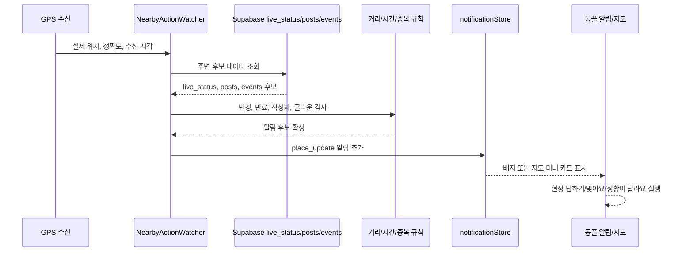

# 내발문자 기획 - 알림 개선

## 목적

이 문서는 기존 [내발문자_설계_알림.md](./내발문자_설계_알림.md)를 바탕으로, GPS 수신을 활용한 `근처 액션 알림`을 기획한다.

핵심은 단순히 "근처에 있으니 알림을 보낸다"가 아니다. 사용자가 동플 앱에 들어왔을 때 바로 할 수 있는 행동을 제안해, 현장 데이터가 다시 쌓이는 순환을 만드는 것이다.

## 개발 전제

현재 동플은 React/Next.js 기반 웹앱으로 개발 중이며, 앱웹 형태로 확장할 계획이다. 아직 네이티브 앱 기능을 사용할 수 있는 단계는 아니다.

따라서 이 문서의 MVP는 다음 전제를 따른다.

- 사용 가능: 브라우저 Geolocation API를 통한 현재 위치 확인
- 사용 가능: 웹앱이 열려 있는 동안의 인앱 알림과 지도 UI 제안
- 사용 불가: 백그라운드 위치 추적
- 사용 불가: OS 레벨 앱 푸시
- 사용 불가: 네이티브 앱 권한 기반의 지속 위치 감시

즉, MVP의 근처 액션 알림은 "앱이 꺼져 있어도 사용자를 깨우는 기능"이 아니라 "사용자가 동플 웹앱을 열었거나 사용 중일 때, 현재 위치와 주변 데이터를 비교해 앱 안에서 행동을 제안하는 기능"이다.

## 한 줄 정의

**내가 지금 가까이 있는 장소에 누군가의 공유나 요청이 있으면, 동플이 3초짜리 현장 행동을 제안한다.**

## 기존 알림 설계에서 보완할 점

| 발견한 점 | 개선 방향 |
| --- | --- |
| `place_update` 타입은 데이터 모델에 있지만 알림 유형 표와 UX가 구체화되어 있지 않다. | `place_update`를 `근처 액션 알림`의 MVP 타입으로 사용하고, metadata에 행동 맥락을 담는다. |
| `status_response`는 "내가 요청한 장소에 응답이 왔을 때" 중심이다. | "내가 근처에 있어서 남의 요청에 답할 수 있을 때" 흐름을 추가한다. |
| 현재 `InterestPlaceNotificationWatcher`는 관심 장소명 매칭과 localStorage 저장 중심이다. | 장소명 매칭보다 좌표 기반 거리 판정을 우선하고, 정확도/쿨다운/중복 방지/딥링크 액션을 명확히 한다. |
| 알림 클릭 결과가 단순 화면 이동에 머문다. | 알림은 지도 이동뿐 아니라 `맞아요`, `상황이 달라요`, `현장 답하기` 같은 즉시 행동으로 이어져야 한다. |
| 위치 권한, 정확도, 기본 위치값에 대한 안전장치가 없다. | 실제 GPS 수신 성공 상태에서만 근처 알림을 만들고, 수원 기본 좌표 같은 fallback 값으로는 알림을 만들지 않는다. |
| 앱 내부 알림과 브라우저/앱 푸시의 경계가 흐려질 수 있다. | MVP는 웹앱이 열린 상태의 인앱 알림으로 제한하고, 백그라운드 푸시는 네이티브 전환 이후 확장으로 둔다. |

## 제품 방향

### 알림의 역할

근처 액션 알림은 "새 소식이 있어요"가 아니라 "지금 여기서 할 수 있는 일이 있어요"에 가깝다.

- 누군가 확인 요청을 남긴 장소 근처에 내가 있다.
- 누군가 공유한 현장 상태가 내 근처에 올라왔다.
- 내가 저장하거나 관심을 둔 장소 근처에 도착했다.
- 진행 중인 행사 현장 근처에 내가 있고, 현재 상태 데이터가 부족하다.

이때 동플은 사용자를 지도 화면으로 데려오고, 사용자는 짧은 액션으로 현장을 확인한다.

### 핵심 문장

- `근처에 확인 요청이 있어요`
- `방금 근처 상황이 올라왔어요`
- `여기 지금도 맞나요?`
- `3초만 현장 상태를 알려주세요`

## 주요 사용자 시나리오

| 시나리오 | 트리거 | 알림 문구 | 주요 행동 | 링크 |
| --- | --- | --- | --- | --- |
| 확인 요청 근처 도착 | `live_status.is_request = true`이고 사용자가 반경 안에 진입 | `근처에 확인 요청이 있어요` | `현장 답하기` | `/map?lat={lat}&lng={lng}&statusId={id}&action=answer_request` |
| 최근 공유 장소 근처 도착 | 다른 사용자의 `live_status`가 최근 생성되고 사용자가 반경 안에 있음 | `방금 근처 상황이 올라왔어요` | `맞아요`, `상황이 달라요` | `/map?lat={lat}&lng={lng}&statusId={id}&action=verify_status` |
| 관심 장소 근처 도착 | 내 기록/관심 장소 근처에 도착했고 최근 상태가 오래됨 | `저장한 장소 근처예요` | `지금 상태 남기기` | `/map?lat={lat}&lng={lng}&action=share_here` |
| 행사 현장 근처 도착 | 진행 중인 행사 좌표 근처에 도착했고 최근 현장 상태가 부족함 | `행사 현장 상태가 필요해요` | `행사 현장 공유` | `/map?eventId={id}&action=share_event_status` |
| 관심 장소 새 소식 | 내가 저장한 장소에 새 소식 또는 새 상태가 올라옴 | `관심장소에 새 소식이 왔어요` | `상태 보기`, `기억하기` | `/map?place={placeName}` |

## 알림 이후 행동 설계

### 1. 현장 답하기

대상은 확인 요청 카드다.

- 사용자는 알림을 누르면 해당 장소가 선택된 지도 화면으로 이동한다.
- 바텀시트는 요청 카드와 함께 `현장 답하기` 버튼을 먼저 보여준다.
- 버튼을 누르면 `liveCreate`를 `mode: "share"`로 열고 장소명, 좌표, 행사 ID를 미리 채운다.
- 사용자는 `한산 / 보통 / 혼잡` 중 하나와 선택 태그만 고르면 된다.

추천 문구:

- 알림 제목: `근처에 확인 요청이 있어요`
- 알림 본문: `{장소명}, 지금 어떤가요?`
- CTA: `현장 답하기`

### 2. 맞아요

대상은 최근 공유된 상태 카드다.

- 사용자가 실제 근처에 있을 때 검증 가치가 높다.
- `status_verifications`에 확인 기록을 남기고 `verified_count`를 올린다.
- 같은 사용자는 같은 상태를 한 번만 확인할 수 있다.
- 확인 직후에는 작은 보상 문구를 보여준다.

추천 문구:

- 알림 제목: `여기 지금도 맞나요?`
- 알림 본문: `{장소명}이 {상태}로 공유됐어요. 근처라면 확인해주세요.`
- CTA: `맞아요`

### 3. 상황이 달라요

대상은 최근 공유된 상태가 현재와 다를 때다.

- `liveCreate`를 `mode: "share"`로 열고 기존 장소 정보를 미리 채운다.
- 기존 상태를 수정하는 것이 아니라 새 상태를 남긴다.
- 완료 후 기존 카드에는 "방금 새 상황이 공유됨"처럼 최신 상태가 반영된다.

추천 문구:

- CTA: `상황이 달라요`
- 완료 문구: `새 현장상황이 반영됐어요`

### 4. 지금 상태 남기기

대상은 내 관심 장소나 행사처럼 아직 최신 데이터가 부족한 장소다.

- 사용자가 저장한 장소 근처에 왔지만 최근 30분 내 `live_status`가 없을 때 제안한다.
- 요청이 없더라도 앱의 데이터 밀도를 높이는 부드러운 참여 유도다.
- 단, 너무 자주 보이면 피로하므로 하루 최대 1회 수준으로 제한한다.

추천 문구:

- 알림 제목: `저장한 장소 근처예요`
- 알림 본문: `{장소명}, 지금 상태를 남겨볼까요?`
- CTA: `지금 상태 남기기`

## UX 진입점

### 인앱 알림

MVP 기본 진입점이다.

- `NotificationBell` 배지에 반영한다.
- `NotificationSheet`에서 `place_update` 알림으로 노출한다.
- 알림 카드에는 장소명, 거리, 최근 시각, 제안 행동을 함께 보여준다.
- 브라우저나 OS 푸시가 아니라 동플 웹앱 내부 UI에서만 노출한다.

### 지도 상단 미니 카드

사용자가 이미 지도에 있다면 종 알림보다 지도 위 행동 카드가 더 자연스럽다.

구성:

- 장소명
- `약 120m 근처`
- `확인 요청` 또는 `최근 공유`
- 주요 버튼 1개와 보조 버튼 1개

예:

- `팔달문시장 근처 확인 요청`
- `현장 답하기`
- `나중에`

### 바텀시트 액션 카드

알림을 누르면 지도 화면의 바텀시트가 해당 장소 액션 모드로 열린다.

추천 구성:

1. 장소명과 거리
2. 현재 맥락: 확인 요청, 최근 공유, 행사 현장
3. 최근 상태 또는 요청 문구
4. 행동 버튼
   - `현장 답하기`
   - `맞아요`
   - `상황이 달라요`
   - `지금 상태 남기기`
5. 보조 제어
   - `오늘 이 장소 알림 끄기`
   - `나중에`

## 데이터 설계

### MVP 알림 타입

기존 `notifications.type`의 `place_update`를 사용한다. 스키마 변경 없이 시작할 수 있고, 기존 `NotificationItem` 타입에도 이미 포함되어 있다.

metadata에 행동 맥락을 구분한다.

```json
{
  "action_kind": "answer_request",
  "source_type": "live_status",
  "source_id": "status uuid",
  "place_name": "팔달문시장",
  "latitude": 37.0,
  "longitude": 127.0,
  "distance_m": 120,
  "radius_m": 250,
  "status": "혼잡",
  "is_request": true,
  "event_id": null,
  "expires_at": "2026-06-08T12:00:00Z"
}
```

### action_kind

| 값 | 의미 |
| --- | --- |
| `answer_request` | 근처 확인 요청에 답하기 |
| `verify_status` | 근처 최근 상태가 맞는지 확인 |
| `correct_status` | 근처 최근 상태가 다르면 새 상태 공유 |
| `share_here` | 관심 장소 또는 데이터 부족 장소에 새 상태 공유 |
| `share_event_status` | 행사 현장 상태 공유 |

### dedupe_key 규칙

같은 장소에서 같은 행동 알림이 반복되지 않도록 한다.

- 확인 요청 답변: `nearby_action:answer_request:{request_status_id}:{user_id}`
- 상태 확인: `nearby_action:verify_status:{status_id}:{user_id}`
- 관심 장소 공유 유도: `nearby_action:share_here:{memory_id}:{yyyyMMdd}`
- 행사 현장 공유: `nearby_action:share_event_status:{event_id}:{yyyyMMdd}`

MVP에서 로컬 알림으로 처리할 경우 `user_id`를 dedupe key에 직접 넣지 않아도 되지만, 서버 알림으로 이동할 때는 사용자별 중복 방지를 위해 포함한다.

## 근처 판정 규칙

### 위치 소스

근처 알림은 실제 GPS 수신 성공 이후에만 만든다.

- 사용 가능: `navigator.geolocation.getCurrentPosition` 또는 `watchPosition`으로 받은 좌표
- 사용 금지: `locationStore`의 기본 수원 좌표 fallback
- 필요 필드: `latitude`, `longitude`, `accuracy`, `received_at`, `source`

현재 `locationStore`에는 기본 좌표가 있으므로, 구현 시 `hasGpsFix` 또는 `locationSource: "gps" | "default"` 같은 구분값을 추가해야 한다.

### 거리 기준

| 장소 유형 | 기본 반경 | 비고 |
| --- | --- | --- |
| 일반 실내 장소 | 150m | 카페, 식당처럼 밀도가 높은 장소 |
| 일반 실외 장소 | 250m | 공원, 광장, 관광지 |
| 행사 | 500m | 행사장 입구와 주변 혼잡까지 포함 |
| GPS 정확도 낮음 | 알림 보류 | `accuracy > 100m`이면 근처 알림을 만들지 않음 |

### 시간 기준

- 최근 공유 상태는 `created_at` 기준 30분 이내를 우선한다.
- `expires_at`이 지난 `live_status`는 알림 대상으로 쓰지 않는다.
- 확인 요청은 최대 60분까지만 근처 알림 대상으로 둔다.
- 같은 장소 알림은 최소 2시간 쿨다운을 둔다.
- 하루 전체 근처 액션 알림은 최대 3개로 제한한다.

### 제외 조건

- 내가 작성한 `live_status` 또는 `post`는 내게 근처 알림을 만들지 않는다.
- 숨김 처리된 상태(`is_hidden = true`)는 제외한다.
- 좌표가 없거나 비정상 좌표인 데이터는 제외한다.
- 사용자가 위치 권한을 거부했으면 근처 알림을 만들지 않는다.
- 사용자가 `오늘 이 장소 알림 끄기`를 누른 장소는 당일 제외한다.

## 처리 흐름



## 구현 방향

### 1차 MVP

웹앱이 열린 상태에서만 작동하는 인앱 근처 액션 알림을 만든다.

- 새 훅: `NearbyActionNotificationWatcher`
- 위치 기준: 실제 GPS 수신 성공 상태
- 데이터 기준: `live_status` 최근 데이터 우선
- 알림 저장: 기존 `notificationStore.prepend()`와 localStorage 기반 중복 방지
- 알림 타입: `place_update`
- 딥링크: `/map?lat={lat}&lng={lng}&statusId={id}&action={action_kind}`
- 위치 호출 방식: 사용자가 동플에 접속했거나 지도/홈에서 위치 확인이 실행된 뒤의 브라우저 위치값만 사용
- 제외 범위: 앱 종료 상태 알림, 백그라운드 위치 감시, OS 푸시

MVP에서 반드시 포함할 액션:

1. 확인 요청 근처 도착 -> `현장 답하기`
2. 최근 공유 장소 근처 도착 -> `맞아요`
3. 최근 공유 장소 근처 도착 -> `상황이 달라요`

### 2차

관심 장소와 행사까지 확장한다.

- `albumMemory`의 favorite/place 타입을 관심 장소 후보로 사용
- 진행 중인 `events` 근처에서 `행사 현장 공유` 제안
- `NotificationSheet` 카드에 액션 버튼 직접 노출
- 알림 설정 추가
  - 근처 액션 알림 on/off
  - 반경 선택
  - 행사 알림 on/off
  - 조용한 시간

### 3차

네이티브 앱 또는 PWA 정책이 명확해진 뒤 백그라운드 푸시와 서버 기반 dedupe로 확장한다.

- Capacitor 앱 전환 여부 확정 후 OS 위치 권한과 백그라운드 정책 검토
- 브라우저 Push API, PWA 푸시, 앱 푸시 중 실제 배포 형태에 맞는 채널 선택
- 서버 Edge Function 또는 RPC로 주변 후보 계산 최적화
- 사용자별 알림 수신 이력 테이블 추가

3차 기능은 현재 개발 범위가 아니다. 지금은 React 웹앱에서 가능한 포그라운드 경험을 먼저 완성한다.

## 기존 코드와 연결 포인트

| 영역 | 현재 상태 | 개선 포인트 |
| --- | --- | --- |
| `InterestPlaceNotificationWatcher` | posts/live_status INSERT를 관심 장소명으로 감지 | GPS 기반 거리 판정 watcher로 분리하거나 확장 |
| `interestPlaceNotifications.ts` | 장소명 정규화, localStorage 중복 방지 | 좌표 거리 계산, 쿨다운, action_kind 생성 추가 |
| `locationStore.ts` | 기본 좌표와 GPS 좌표가 같은 상태 필드에 저장됨 | `hasGpsFix`, `accuracy`, `receivedAt`, `locationSource` 추가 |
| `notificationService.ts` | `place_update` 타입 지원 | 근처 액션 알림 builder 추가 |
| `NotificationSheet` | 알림 클릭 후 link_url 이동 | metadata.action_kind에 따라 지도 액션 모드로 진입 |
| `MapBottomSheet` | `맞아요`, `상황이 달라요`, 공유 흐름이 일부 존재 | 알림 진입 시 해당 버튼이 우선 보이도록 액션 모드 처리 |

## 알림 문구 가이드

문구는 감시받는 느낌보다 "현장에서 도와줄 수 있는 작은 요청"으로 보여야 한다.

| 상황 | 제목 | 본문 | CTA |
| --- | --- | --- | --- |
| 확인 요청 | `근처에 확인 요청이 있어요` | `{장소명}, 지금 어떤가요?` | `현장 답하기` |
| 상태 검증 | `여기 지금도 맞나요?` | `{장소명}이 {상태}로 공유됐어요.` | `맞아요` |
| 상태 정정 | `근처 상황이 바뀌었나요?` | `{장소명}의 최근 상태를 새로 남길 수 있어요.` | `상황이 달라요` |
| 관심 장소 | `저장한 장소 근처예요` | `{장소명}, 지금 상태를 남겨볼까요?` | `지금 상태 남기기` |
| 행사 | `행사 현장 상태가 필요해요` | `{행사명}, 지금 붐비나요?` | `행사 현장 공유` |

피해야 할 문구:

- `당신은 지금 {장소명}에 있습니다`
- `위치가 감지되었습니다`
- `추적 중입니다`

권장 문구:

- `근처`
- `지금`
- `현장`
- `확인`
- `3초`

## 개인정보와 신뢰 원칙

- 위치는 알림 후보 계산에만 사용하고, 사용자가 액션을 완료하기 전에는 서버에 저장하지 않는다.
- 근처 알림 본문에는 사용자의 정확한 위치를 쓰지 않는다.
- 위치 권한을 거부해도 앱의 기본 탐색 기능은 계속 사용할 수 있어야 한다.
- 위치 기반 알림은 설정에서 끌 수 있어야 한다.
- 알림이 만들어진 이유를 카드 안에서 짧게 설명한다.
  - 예: `근처 확인 요청`
  - 예: `저장한 장소 근처`
- 부정확한 GPS나 기본 좌표로 알림을 만들면 신뢰를 크게 잃으므로 보수적으로 동작한다.

## 성공 기준

- 근처 알림을 받은 사용자의 20% 이상이 지도 화면으로 진입한다.
- 근처 알림을 받은 사용자의 8% 이상이 `맞아요` 또는 `현장 답하기`를 완료한다.
- `현장 답하기` 완료까지 3초 안팎으로 가능하다.
- 위치 알림을 끄는 비율이 높지 않다.
- 같은 장소 반복 알림에 대한 불만이 없다.
- 확인 요청의 평균 응답 시간이 줄어든다.

## QA 체크리스트

- 위치 권한 거부 상태에서는 근처 알림이 생성되지 않는다.
- 앱 기본 좌표만 있는 상태에서는 근처 알림이 생성되지 않는다.
- GPS 정확도가 낮으면 알림이 생성되지 않는다.
- 내가 작성한 상황 공유는 내게 알림으로 오지 않는다.
- 만료된 `live_status`는 알림으로 오지 않는다.
- 같은 `status_id`는 같은 사용자에게 반복 알림으로 오지 않는다.
- 알림을 누르면 지도에서 해당 장소가 선택된다.
- `현장 답하기`는 장소명과 좌표가 미리 채워진 공유 흐름을 연다.
- `맞아요`는 중복 검증을 만들지 않는다.
- `상황이 달라요`는 기존 상태 수정이 아니라 새 상태 공유로 저장된다.
- 하루 알림 제한과 장소별 쿨다운이 작동한다.
- 알림 카드의 `오늘 이 장소 알림 끄기`가 당일 반복 알림을 막는다.

## 최종 방향

기존 알림은 사용자를 다시 앱으로 데려오는 장치였다. 근처 액션 알림은 한 단계 더 나아가, 사용자가 현장에 있을 때 동플의 데이터 생산자가 되도록 돕는 장치다.

동플이 사용자에게 던지는 질문은 단순하다.

**"지금 근처예요. 3초만 알려줄래요?"**
