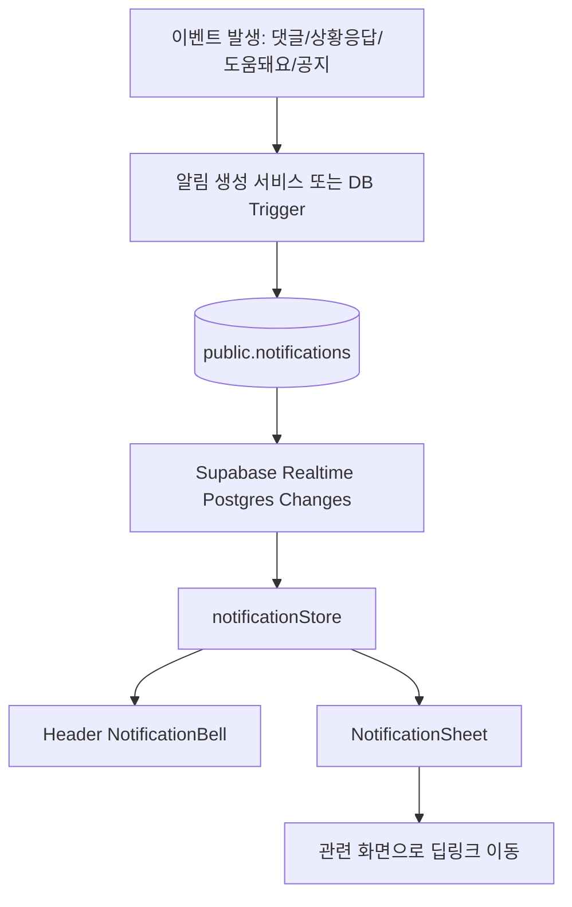
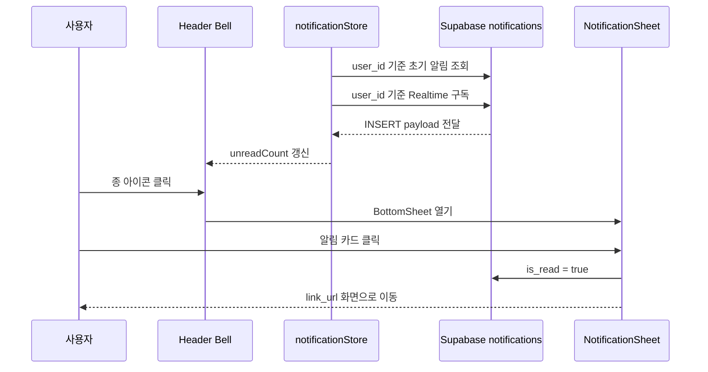

# 내발문자 설계 - 알림

## 역할

- 사용자가 남긴 소식, 상황요청, 기록에 대한 반응을 놓치지 않게 알려주는 개인 알림함
- `홈 / 지도 / 기록 / 소식 / 내발문자`를 다시 방문하게 만드는 재진입 장치
- 실시간 현장 정보 공유 서비스의 상호작용 밀도를 높이는 공통 기능

## 핵심 목표

- 내가 쓴 소식에 댓글이 달리면 바로 알 수 있다.
- 내가 요청한 장소의 상황이 공유되면 바로 확인할 수 있다.
- 내 기록이나 제보가 도움이 되었을 때 신뢰 상승을 체감할 수 있다.
- 서비스 공지나 주요 업데이트를 앱 안에서 확인할 수 있다.
- 알림을 누르면 관련 화면으로 바로 이동한다.

## 알림 범위

- 1차 범위는 앱 내부 알림이다.
- 브라우저 푸시, 문자, 카카오 알림톡, 이메일은 2차 확장 범위로 둔다.
- MVP에서는 `Supabase DB + Supabase Realtime + Zustand store + BottomSheet UI`로 구현한다.
- 알림 내용에는 민감 정보나 개인 식별 정보를 넣지 않는다.

## 핵심 아키텍처



## 데이터 모델

### public.notifications

| 필드명 | 타입 | 설명 |
| --- | --- | --- |
| `id` | UUID | 알림 고유 식별자 |
| `user_id` | TEXT | 수신자 ID. 로그인 사용자는 Auth UUID, 익명 사용자는 `u-...` |
| `type` | TEXT | `reply`, `status_response`, `trust`, `system` |
| `title` | TEXT | 알림 제목 |
| `content` | TEXT | 알림 본문 |
| `link_url` | TEXT | 클릭 시 이동할 내부 경로 |
| `metadata` | JSONB | 관련 post/status/place id 등 보조 데이터 |
| `is_read` | BOOLEAN | 읽음 여부 |
| `read_at` | TIMESTAMPTZ | 읽은 시각 |
| `dedupe_key` | TEXT | 중복 알림 방지 키 |
| `created_at` | TIMESTAMPTZ | 생성 시각 |

### SQL 초안

```sql
CREATE TABLE IF NOT EXISTS public.notifications (
  id UUID PRIMARY KEY DEFAULT gen_random_uuid(),
  user_id TEXT NOT NULL,
  type TEXT NOT NULL CHECK (type IN ('reply', 'status_response', 'trust', 'system')),
  title TEXT NOT NULL,
  content TEXT NOT NULL,
  link_url TEXT NOT NULL,
  metadata JSONB NOT NULL DEFAULT '{}'::jsonb,
  is_read BOOLEAN NOT NULL DEFAULT FALSE,
  read_at TIMESTAMPTZ,
  dedupe_key TEXT UNIQUE,
  created_at TIMESTAMPTZ NOT NULL DEFAULT NOW()
);

CREATE INDEX IF NOT EXISTS idx_notifications_user_created
  ON public.notifications (user_id, created_at DESC);

CREATE INDEX IF NOT EXISTS idx_notifications_unread
  ON public.notifications (user_id, is_read, created_at DESC);

ALTER TABLE public.notifications ENABLE ROW LEVEL SECURITY;

CREATE POLICY "알림 본인 읽기 허용"
  ON public.notifications
  FOR SELECT
  USING (
    auth.uid() IS NOT NULL
    AND user_id = auth.uid()::TEXT
  );

CREATE POLICY "알림 본인 읽음 처리 허용"
  ON public.notifications
  FOR UPDATE
  USING (
    auth.uid() IS NOT NULL
    AND user_id = auth.uid()::TEXT
  )
  WITH CHECK (
    auth.uid() IS NOT NULL
    AND user_id = auth.uid()::TEXT
  );

ALTER PUBLICATION supabase_realtime ADD TABLE public.notifications;
```

## 익명 사용자 정책

- 현재 앱은 `src/lib/auth-utils.ts`의 `getPersistentUserId()`로 `u-...` 형식의 로컬 익명 ID를 만든다.
- MVP에서는 알림 수신 주소로 `useAuthStore.userId`를 사용한다.
- 로그인 사용자는 Auth UUID, 익명 사용자는 로컬 `u-...` ID가 된다.
- 익명 알림은 브라우저 로컬 저장소에 의존하므로 캐시 삭제 시 이전 알림 접근이 어렵다.
- 익명 ID는 서버가 소유권을 강하게 검증하기 어렵다. 따라서 익명 알림에는 민감한 내용을 담지 않는다.
- 장기적으로는 Supabase Auth Anonymous User를 도입해 익명 사용자도 `auth.uid()` 기반 RLS로 보호한다.

## RLS 운영 판단

- 로그인 사용자 알림은 `auth.uid()::TEXT = user_id` 정책으로 보호한다.
- 로컬스토리지 기반 익명 사용자까지 같은 테이블에서 직접 읽게 하려면 RLS 검증이 약해진다.
- 안전한 운영 우선순위는 다음 순서다.
  1. 로그인 사용자 알림부터 RLS 기반으로 안정화
  2. 익명 알림은 민감도 낮은 인앱 힌트로만 제공
  3. Supabase Auth Anonymous User 도입 후 익명 알림도 RLS 보호
- Supabase Realtime Postgres Changes는 RLS 정책상 읽을 수 있는 row만 클라이언트에 전달되도록 설계한다.

## 알림 유형

| 시나리오 | type | 트리거 | 링크 |
| --- | --- | --- | --- |
| 답글 알림 | `reply` | 내가 쓴 소식에 다른 사용자가 댓글 작성 | `/news/post/[id]` 또는 현재 구현 가능한 상세 경로 |
| 상황응답 알림 | `status_response` | 내가 요청한 장소에 새 상황 공유 등록 | `/map?place=[id]` |
| 신뢰도 상승 | `trust` | 내 기록 또는 제보가 도움돼요/검증을 받아 점수 상승 | `/album` |
| 시스템 공지 | `system` | 서비스 공지, 기능 업데이트, 운영 메시지 | `/` |

## 중복 방지 규칙

- 같은 댓글은 알림을 한 번만 만든다.
- 같은 상황요청에 같은 상황응답자가 반복 등록한 경우 짧은 시간 안에서는 묶는다.
- `dedupe_key`는 다음 형식을 사용한다.
  - 댓글: `reply:{post_id}:{comment_id}`
  - 상황응답: `status_response:{request_status_id}:{response_status_id}`
  - 신뢰도: `trust:{target_type}:{target_id}:{score_event_id}`
  - 시스템: `system:{notice_id}`

## 생성 위치

### 1차 구현

- `src/services/notificationService.ts`에서 알림 CRUD와 생성 helper를 담당한다.
- 댓글 생성 후 `createComment()` 흐름에서 게시글 작성자에게 알림을 생성한다.
- 상황응답 생성 후 `postLiveStatus()` 또는 호출부에서 기존 요청자에게 알림을 생성한다.

### 2차 구현

- DB Trigger 또는 Edge Function으로 알림 생성을 이동한다.
- 클라이언트가 실패해도 서버 이벤트 기준으로 알림이 생성되도록 안정화한다.
- 관리자 공지는 별도 운영 도구 또는 SQL insert로 생성한다.

## 클라이언트 store 설계

### 파일

- `src/lib/store/notificationStore.ts`

### 상태

| 상태 | 설명 |
| --- | --- |
| `items` | 최신 알림 목록 |
| `unreadCount` | 읽지 않은 알림 개수 |
| `isLoading` | 초기 로딩 상태 |
| `isSubscribed` | 실시간 구독 여부 |
| `error` | 조회 또는 업데이트 실패 메시지 |

### 액션

| 액션 | 설명 |
| --- | --- |
| `init(userId)` | 알림 목록 조회와 실시간 구독 시작 |
| `fetchNotifications(userId)` | 최신 알림 목록 조회 |
| `subscribe(userId)` | `notifications` INSERT/UPDATE 구독 |
| `unsubscribe()` | 기존 Realtime 채널 해제 |
| `markAsRead(id)` | 단건 읽음 처리 |
| `markAllAsRead(userId)` | 전체 읽음 처리 |
| `prepend(notification)` | 새 알림을 목록 앞에 추가 |
| `reset()` | 로그아웃 또는 사용자 전환 시 초기화 |

## UI 설계

### NotificationBell

- 위치: `src/features/notifications/components/NotificationBell.tsx`
- 기존 `Header.tsx`의 `Bell` 아이콘을 대체한다.
- 읽지 않은 알림이 있으면 우측 상단에 빨간 점 또는 숫자 배지를 표시한다.
- 클릭 시 `openBottomSheet("notifications")`를 호출한다.
- 접근성 라벨은 `알림 열기`로 둔다.

### NotificationSheet

- 위치: `src/features/notifications/components/NotificationSheet.tsx`
- 전역 `BottomSheet` 안에서 렌더링한다.
- 상단에는 `알림` 제목과 `모두 읽음` 버튼을 둔다.
- 목록은 최신순으로 보여준다.
- 읽지 않은 알림은 왼쪽 포인트, 굵은 제목, 약한 배경으로 구분한다.
- 알림 클릭 시 읽음 처리 후 `link_url`로 이동하고 BottomSheet를 닫는다.
- 알림이 없을 때는 빈 상태를 보여준다.

## 화면 흐름



## 딥링크 규칙

- 내부 이동은 `next/navigation`의 `router.push()`를 사용한다.
- 현재 상세 페이지 라우트가 없으면 BottomSheet 기반 상세 열기와 충돌하지 않도록 임시 링크를 사용한다.
- 최종 목표 링크는 다음과 같다.
  - 소식 상세: `/news/post/[id]`
  - 장소/상황: `/map?place=[id]`
  - 나의 내발문자: `/album`
  - 공지: `/`

## 기존 구조와 연결

- `Header.tsx`
  - 정적 `Bell` 아이콘을 `NotificationBell`로 교체한다.
- `uiStore.ts`
  - `BottomSheetContent`에 `notifications`를 추가한다.
- `BottomSheet.tsx`
  - titleMap에 `notifications: "알림"`을 추가한다.
  - content 렌더링 영역에 `NotificationSheet`를 추가한다.
- `authStore.ts`
  - `userId` 변경 시 알림 store가 재초기화되도록 `NotificationBell`에서 감지한다.
- `/map`
  - Header가 숨겨지는 화면이므로 지도 전용 헤더 또는 지도 UI에 알림 진입점을 둘 수 있다.

## 알림 생성 상세

### 답글 알림

- 댓글 작성 성공 후 원글 작성자를 조회한다.
- 원글 작성자와 댓글 작성자가 같으면 알림을 만들지 않는다.
- 알림 제목은 `새 댓글이 달렸어요`로 시작한다.
- 내용은 글 제목 또는 본문 일부를 포함하되 60자 안팎으로 줄인다.

### 상황응답 알림

- `is_request = false`인 새 `live_status`가 생성될 때 같은 장소 또는 같은 행사에 걸린 요청을 찾는다.
- 요청자와 응답자가 같으면 알림을 만들지 않는다.
- 링크는 지도 화면으로 이동한다.
- 내용은 장소명과 상태 값을 중심으로 만든다.

### 신뢰도 상승 알림

- `verify_status_once` 또는 도움돼요 이벤트에서 점수 상승 기준을 넘을 때 생성한다.
- 너무 잦은 알림을 막기 위해 점수 구간을 기준으로 보낸다.
  - 예: 0.8 도달, 1.0 도달, 배지 상승

### 시스템 공지

- 운영자가 특정 사용자 또는 전체 사용자에게 생성한다.
- 전체 사용자 공지는 별도 `system_notices` 테이블을 두거나, 대상 사용자별 `notifications` row를 생성한다.
- MVP에서는 대상 사용자별 row 생성 방식을 사용한다.

## 상태 처리

- 목록 조회 실패 시 알림 아이콘은 그대로 보이고 오류는 콘솔과 store error에만 저장한다.
- 읽음 처리 실패 시 화면 이동은 막지 않는다.
- Realtime 구독 실패 시 초기 조회와 수동 새로고침으로 최소 경험을 유지한다.
- 동일 알림 payload가 중복 수신되면 `id` 기준으로 한 번만 목록에 넣는다.

## MVP 구현 순서

1. `public.notifications` 테이블과 인덱스 생성
2. `notificationService.ts` 추가
3. `notificationStore.ts` 추가
4. `NotificationBell` 추가 후 Header 연결
5. `NotificationSheet` 추가 후 BottomSheet 연결
6. 댓글 알림 생성 연결
7. 상황응답 알림 생성 연결
8. QA 시나리오 검증

## QA 체크리스트

- 알림이 없는 사용자는 빈 상태가 보인다.
- 읽지 않은 알림이 있으면 종 아이콘에 배지가 보인다.
- 새 알림 INSERT 시 화면 새로고침 없이 배지가 갱신된다.
- 알림 카드를 누르면 읽음 처리 후 관련 화면으로 이동한다.
- `모두 읽음`을 누르면 배지가 사라진다.
- 다른 사용자 알림은 조회되지 않는다.
- 자기 글에 자기 댓글을 달아도 알림이 생기지 않는다.
- 브라우저 새로고침 후에도 알림 목록과 읽음 상태가 유지된다.
- 익명 사용자는 같은 브라우저에서 알림을 유지한다.
- 로그아웃/로그인 전환 시 이전 사용자의 알림이 남지 않는다.

## 확장 계획

- 브라우저 Push API 연동
- 알림 설정 화면 추가
  - 댓글 알림 on/off
  - 상황응답 알림 on/off
  - 공지 알림 on/off
- 알림 묶음 처리
  - 같은 글의 댓글 N개
  - 같은 장소의 상황 업데이트 N개
- 관리자 공지 작성 도구
- Supabase Auth Anonymous User 도입
- 서버 Trigger 또는 Edge Function 기반 생성으로 이동

## 참고 문서

- Supabase Row Level Security: <https://supabase.com/docs/guides/database/postgres/row-level-security>
- Supabase Realtime Postgres Changes: <https://supabase.com/docs/guides/realtime/postgres-changes>
- Supabase Realtime Authorization: <https://supabase.com/docs/guides/realtime/authorization>
